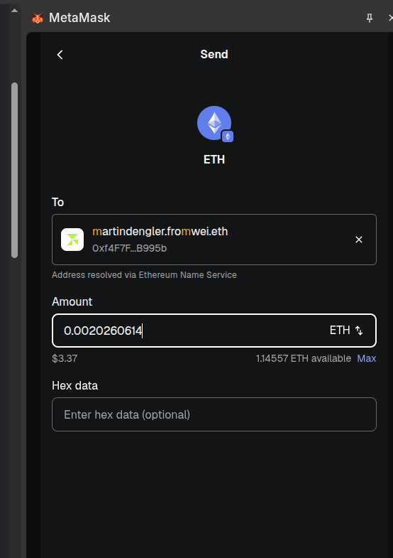

### ETHGlobal 2026 NYC submission  TeamA (working name)


#### Intro

An [ENSIP-10](https://docs.ens.domains/ensip/10/) wildcard resolver that bridges the
[Wei Name Service](https://github.com/z0r0z/wei-names) into ENS: any `<label>.fromwei.eth`
resolves to the address of `<label>.wei`.

- Resolver: [`0x8403F2BEE92296a1858fb83A019899D01a502abe`](https://etherscan.io/address/0x8403F2BEE92296a1858fb83A019899D01a502abe#code)
- Parent: `fromwei.eth`, with its ENS resolver set to the contract above.


#### Quickstart

```
$ cast resolve-name martindengler.eth --rpc-url "$ETH_RPC_URL"
0xf4F7F1BD0905EFe61382dE895eC3C1eD321B995b
```

```
$ cast resolve-name martindengler.fromwei.eth --rpc-url "$ETH_RPC_URL"
0xf4F7F1BD0905EFe61382dE895eC3C1eD321B995b
```


#### Video/Demo



Any `<label>.fromwei.eth` resolves through ENS to the address of `<label>.wei` in the
Wei Name Service, via the wildcard resolver.

| ENS name | resolves to |
|---|---|
| `eg26nyc.fromwei.eth` | `0xf4F7F1BD0905EFe61382dE895eC3C1eD321B995b` |
| `martindengler.fromwei.eth` | `0xf4F7F1BD0905EFe61382dE895eC3C1eD321B995b` |

**How to check your .wei name**

Terminal (uses the ENS UniversalResolver, exactly like a wallet):

```
cast resolve-name eg26nyc.fromwei.eth
cast resolve-name martindengler.fromwei.eth
# -> 0xf4F7F1BD0905EFe61382dE895eC3C1eD321B995b
```

On Etherscan — open the resolver's
[`resolve` function](https://etherscan.io/address/0x8403F2BEE92296a1858fb83A019899D01a502abe#readContract),
paste the two values, and click Query. The answer is the last 20 bytes of the output; `data` is the
same for every name (the `addr(bytes32)` selector with a zero node, which the resolver ignores — it
derives the `.wei` node from `name`).

- `eg26nyc.fromwei.eth`
  - `name` = `0x07656732366e79630766726f6d7765690365746800`
  - `data` = `0x3b3b57de0000000000000000000000000000000000000000000000000000000000000000`
- `martindengler.fromwei.eth`
  - `name` = `0x0d6d617274696e64656e676c65720766726f6d7765690365746800`
  - `data` = `0x3b3b57de0000000000000000000000000000000000000000000000000000000000000000`

Block-explorer *search boxes* (Etherscan, Blockchair) don't perform ENSIP-10 wildcard resolution, so
they report these subnames as "not found". Wallets (MetaMask), `viem`, `ethers`, and `cast` resolve
them correctly.


#### Hacking / Next steps

- see if we can handle reverse resolution
- see if etherscan.io can do ENS resolves fully -- change a wei name to a new
  wallet and try that
